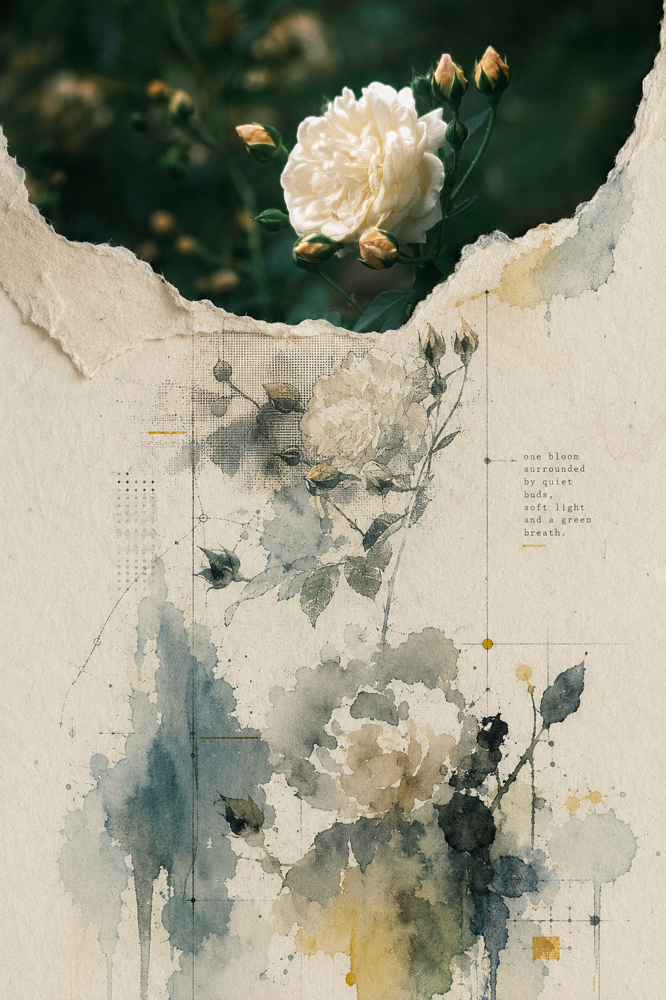
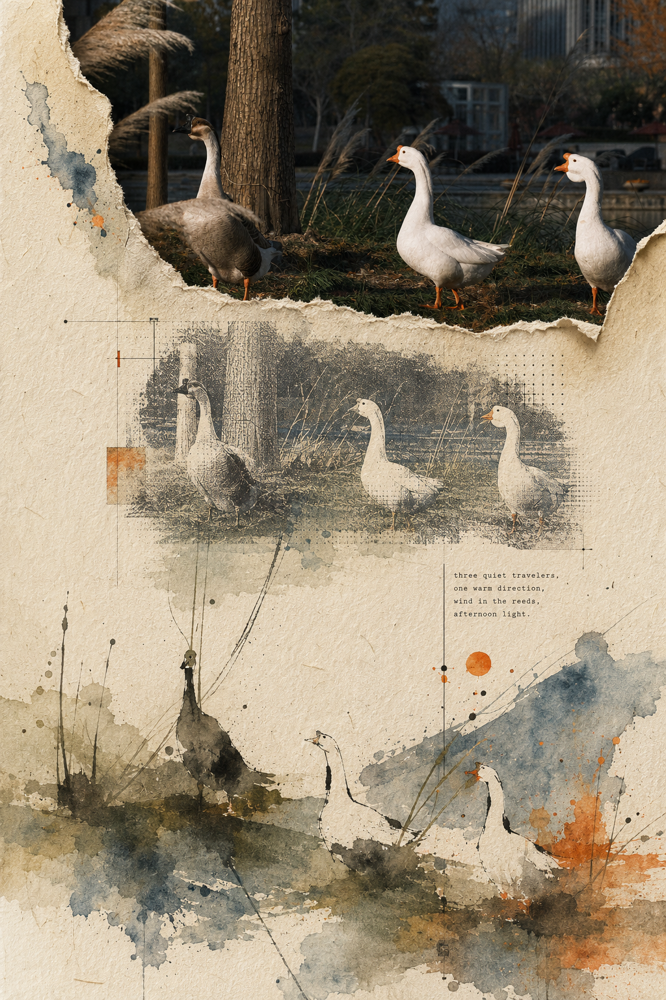
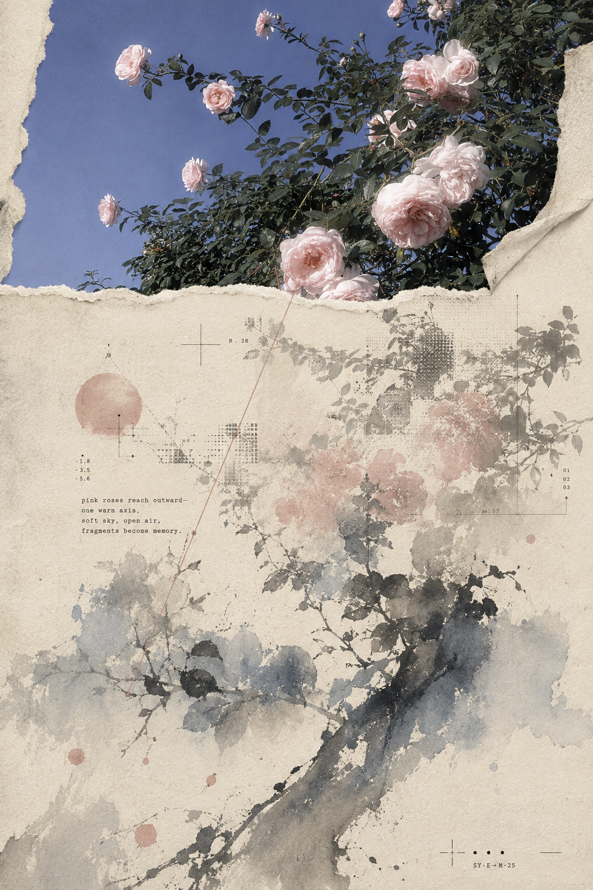
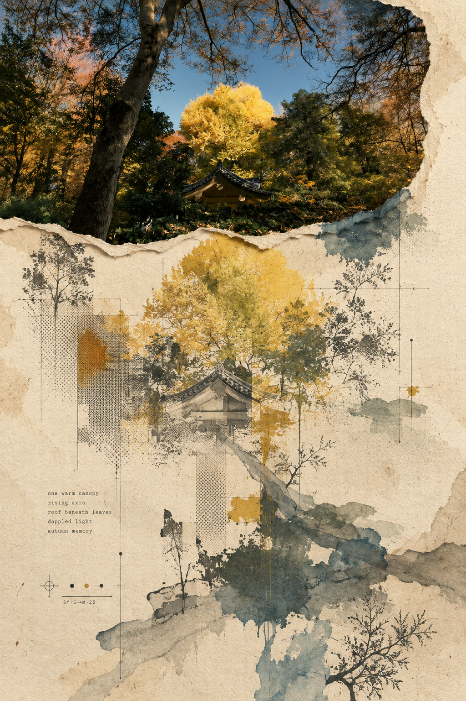
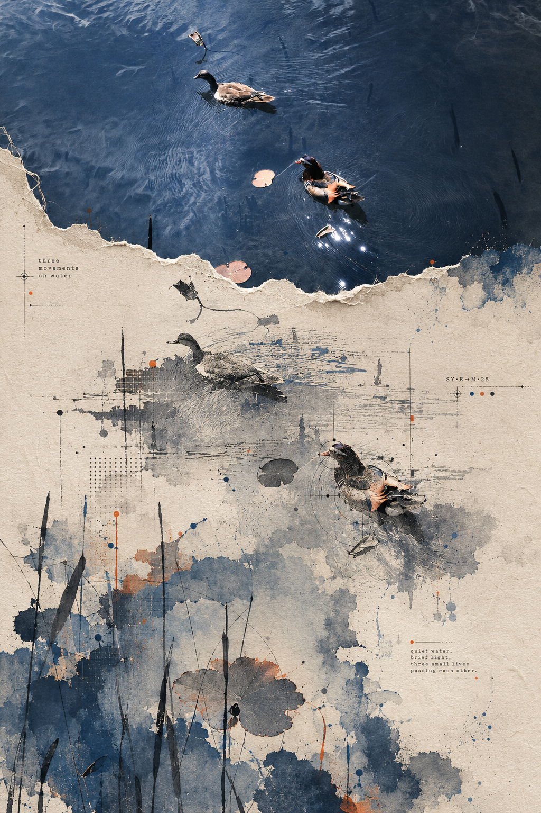
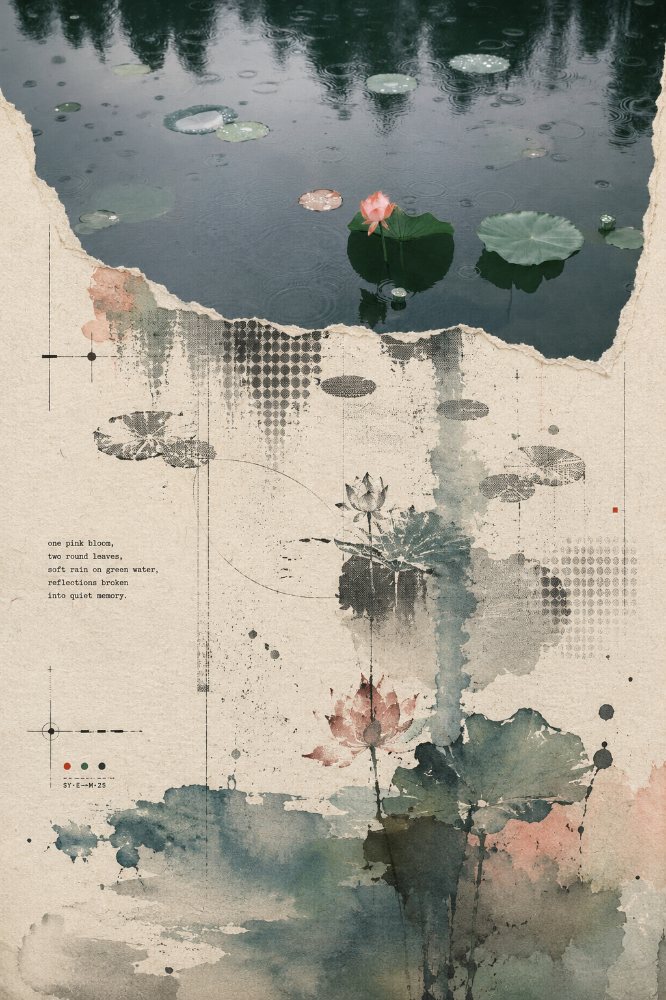
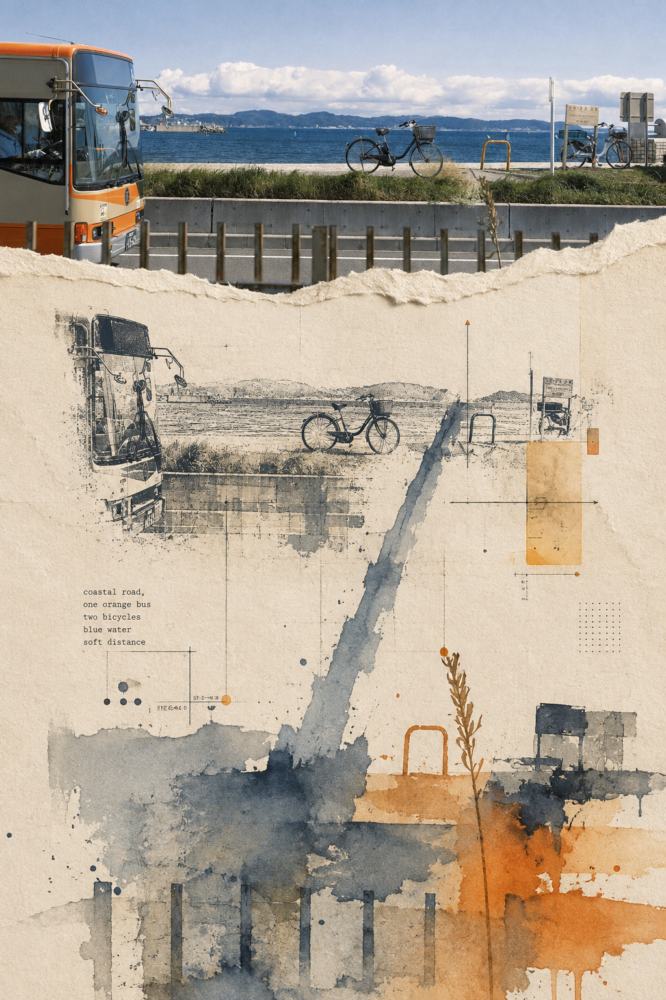
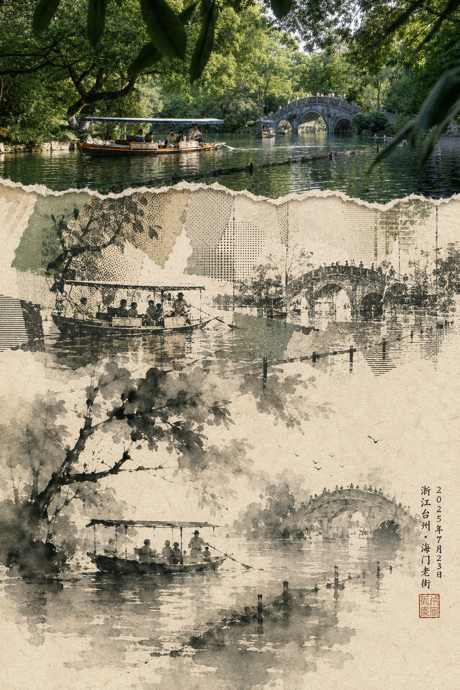
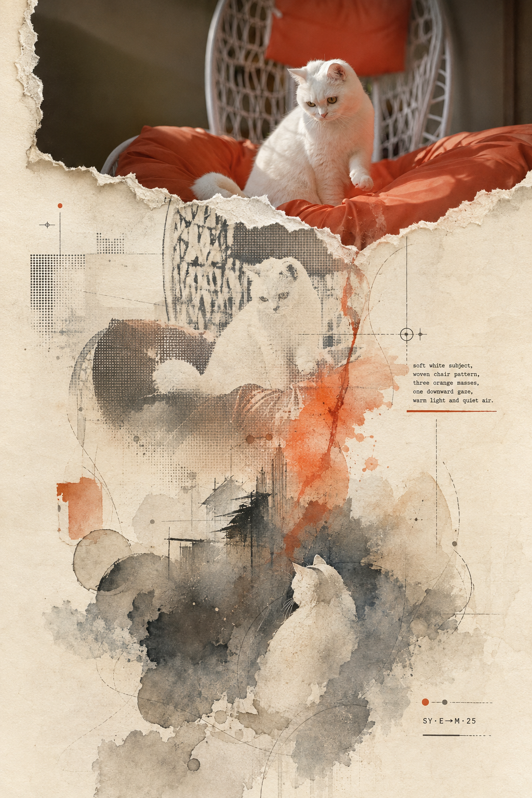
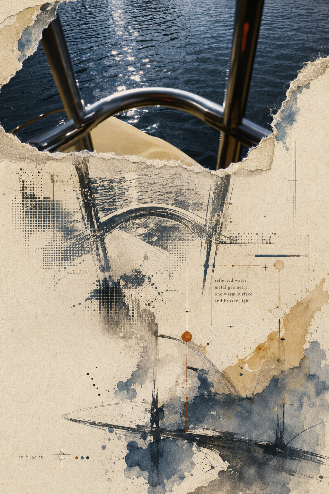

# S.005 · Starryear-Ink 星年水墨

将一张真实摄影转译为一张连续的竖向纸本作品：

`摄影证据 → 干性印刷记忆 → 彩墨余像`

Starryear-Ink 保留原照片的直接证据带，让场景在向下移动时逐步碎裂、抽象并释放为来源绑定的彩墨关系。它不是整图水墨滤镜，也不是传统山水画风格转换。

## Skill 信息

- 作者：**Starryear**
- 当前版本：**2.1.0**
- 画布：**1024 × 1536 RGB**
- 许可证：[Starryear Personal Use and Attribution License](LICENSE.md)
- 完整方法：[SKILL.md](SKILL.md)
- 原始口令：[【005】Starryear-Ink 星年水墨.txt](%E3%80%90005%E3%80%91Starryear-Ink%20%E6%98%9F%E5%B9%B4%E6%B0%B4%E5%A2%A8.txt)
- 专属网站：[starryear.github.io/Starryear-Ink](https://starryear.github.io/Starryear-Ink/)

## 安装

下载 [`Starryear-Ink-Skill-v2.1.0.zip`](https://github.com/Starryear/Starryear-Ink/releases/download/v2.1.0/Starryear-Ink-Skill-v2.1.0.zip)，解压到 Codex Skills 目录，或直接复制本仓库内容并保持目录结构不变。

## 参考作品

| 01 | 02 |
| --- | --- |
|  |  |
| 03 | 04 |
|  |  |
| 05 | 06 |
|  |  |
| 07 | 08 |
|  |  |
| 09 | 10 |
|  |  |

这些图片仅用于理解和运行本 Skill，不可提取、转载、售卖或作为素材库使用。详细限制见 [LICENSE.md](LICENSE.md)。

## 公开署名

`使用 Starryear-Ink 创作｜作者：Starryear`

© 2026 Starryear.
